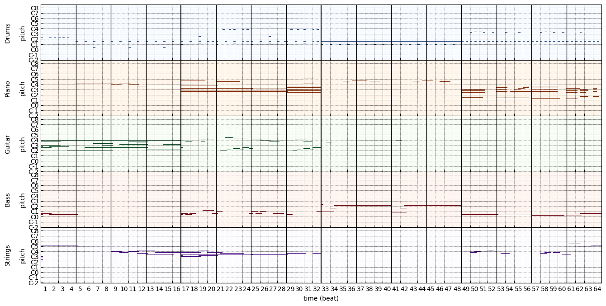

# MusicGeneration_DeepLearning
This is the project of Deep Learning System course

This project is aimed to explore the deep learning power in music generation.

The dataset We used is LPD-5-cleansed

## To run the code
1. They are run in the Jupyter Lab
2. The requirments.txt contains the environment library
   You could install them by: pip install -r requirements.txt
3. Conda virtual envirment is recommended.

## Code Structure:
1. GAN_music.ipynb: use GAN to generate music
2. RNN_single_node: extract pianol track , use RNN single note prediction to generate music
3. RNN_music: use 5 pianol tracks, use RNN to generate music by note prediction
4. VAEs: Use VAE to generate music

## The sample music contains in the /generated_music fold

The visualization of music tracks in the train data: 

